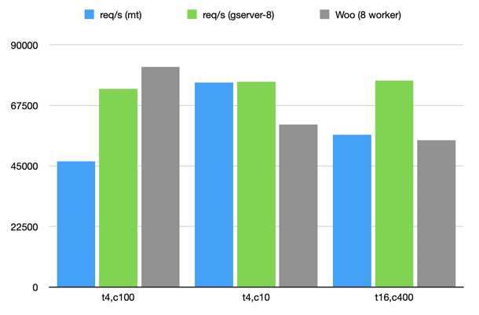

# cl-tbnl-gserver-tmgr
Hunchentoot Gserver based taskmanager (experimental)

## Usage

Create an accessor using this taskmanager like so:

```
(let ((acceptor (make-instance 'tbnl:easy-acceptor
                                 :port 4242
                                 :taskmaster (make-instance 'gserver-tmgr
                                                            :max-thread-count 8))))
  (tbnl:start acceptor)
```

With `:max-thread-count` you can control how many `gservers` should be spawned.


## Some benchmarks

### Multi-threaded (default hunchentoot):
```
wrk -t4 -c100 -d10 "http://localhost:4242/yo"
Running 10s test @ http://localhost:4242/yo
  4 threads and 100 connections
  Thread Stats   Avg      Stdev     Max   +/- Stdev
    Latency    33.63ms   64.77ms 580.44ms   86.79%
    Req/Sec    12.16k    10.56k   54.88k    75.28%
  470142 requests in 10.08s, 65.91MB read
  Socket errors: connect 0, read 85, write 0, timeout 0
Requests/sec:  46635.24
Transfer/sec:      6.54MB

wrk -t4 -c10 -d10 "http://localhost:4242/yo"
Running 10s test @ http://localhost:4242/yo
  4 threads and 10 connections
  Thread Stats   Avg      Stdev     Max   +/- Stdev
    Latency   233.03us  759.27us  13.93ms   96.07%
    Req/Sec    19.09k   556.09    20.40k    67.33%
  767444 requests in 10.10s, 107.59MB read
Requests/sec:  75961.66
Transfer/sec:     10.65MB
---------- Can't handle ------------
wrk -t16 -c400 -d10 "http://localhost:4242/yo"
Running 10s test @ http://localhost:4242/yo
  16 threads and 400 connections
  Thread Stats   Avg      Stdev     Max   +/- Stdev
    Latency    28.71ms   80.52ms 750.72ms   90.82%
    Req/Sec     3.90k     3.99k   32.81k    87.00%
  571817 requests in 10.10s, 80.66MB read
  Socket errors: connect 165, read 3371, write 80, timeout 1
  Non-2xx or 3xx responses: 2972
Requests/sec:  56635.62
Transfer/sec:      7.99MB
```


### gserver (8 workers random order):
```
wrk -t4 -c100 -d10 "http://localhost:4242/yo"
Running 10s test @ http://localhost:4242/yo
  4 threads and 100 connections
  Thread Stats   Avg      Stdev     Max   +/- Stdev
    Latency   163.33us    1.37ms 101.71ms   99.26%
    Req/Sec    18.52k    11.51k   40.69k    74.25%
  737186 requests in 10.01s, 103.35MB read
  Socket errors: connect 0, read 112, write 0, timeout 0
Requests/sec:  73647.69
Transfer/sec:     10.32MB

wrk -t4 -c10 -d10 "http://localhost:4242/yo"
Running 10s test @ http://localhost:4242/yo
  4 threads and 10 connections
  Thread Stats   Avg      Stdev     Max   +/- Stdev
    Latency   457.93us    3.52ms  96.69ms   97.21%
    Req/Sec    19.16k     6.69k   27.72k    58.75%
  763236 requests in 10.01s, 107.00MB read
Requests/sec:  76257.12
Transfer/sec:     10.69MB
---------------------------------------
wrk -t16 -c400 -d10 "http://localhost:4242/yo"
Running 10s test @ http://localhost:4242/yo
  16 threads and 400 connections
  Thread Stats   Avg      Stdev     Max   +/- Stdev
    Latency   106.74us  651.85us  98.07ms   99.86%
    Req/Sec    19.41k    16.96k   70.09k    74.31%
  774766 requests in 10.10s, 108.61MB read
  Socket errors: connect 165, read 242, write 0, timeout 0
Requests/sec:  76711.31
Transfer/sec:     10.75MB
```

### Woo (8 workers)

```
wrk -t4 -c100 -d10 "http://localhost:5000"
Running 10s test @ http://localhost:5000
  4 threads and 100 connections
  Thread Stats   Avg      Stdev     Max   +/- Stdev
    Latency     1.30ms    0.87ms   9.08ms   82.67%
    Req/Sec    20.57k     1.06k   23.20k    66.75%
  819004 requests in 10.01s, 121.06MB read
Requests/sec:  81838.94
Transfer/sec:     12.10MB

wrk -t4 -c10 -d10 "http://localhost:5000"
Running 10s test @ http://localhost:5000
  4 threads and 10 connections
  Thread Stats   Avg      Stdev     Max   +/- Stdev
    Latency   221.40us  356.67us   4.66ms   90.30%
    Req/Sec    15.19k   310.79    15.81k    74.01%
  610637 requests in 10.10s, 90.26MB read
Requests/sec:  60444.28
Transfer/sec:      8.93MB
------------- massive connection errors --------------------
wrk -t16 -c400 -d10 "http://localhost:5000"
Running 10s test @ http://localhost:5000
  16 threads and 400 connections
  Thread Stats   Avg      Stdev     Max   +/- Stdev
    Latency     4.16ms    2.43ms  42.78ms   84.66%
    Req/Sec     3.43k     1.70k    7.08k    50.25%
  546714 requests in 10.02s, 80.82MB read
  Socket errors: connect 165, read 32513, write 0, timeout 0
Requests/sec:  54581.30
Transfer/sec:      8.07MB
```

CCL is ~2-3 times slower on all configs.

Measured with wrk tool.

t = threads  
c = connections  
mt = default multi-threaded hunchentoot taskmanager  
gserver-8 = taskmanager based on 8 GServer handlers  


